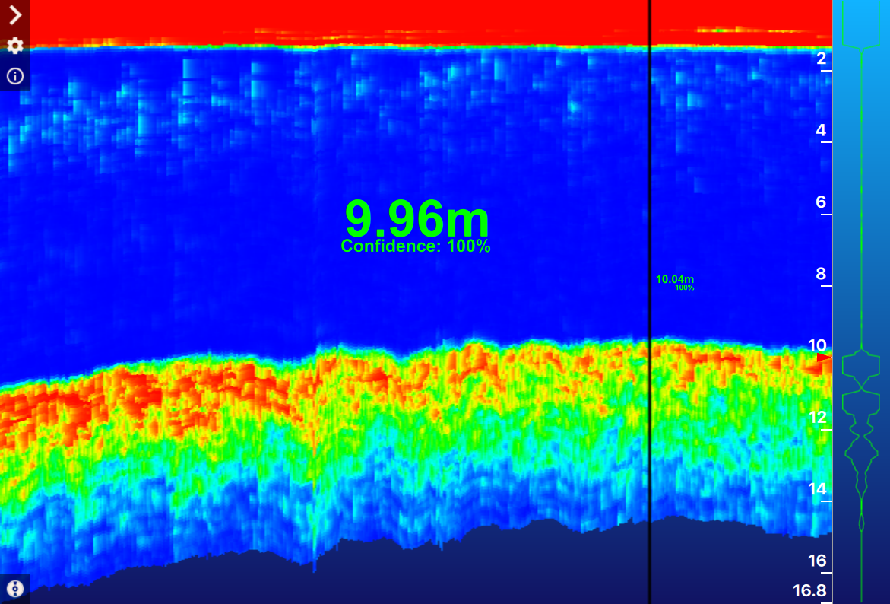
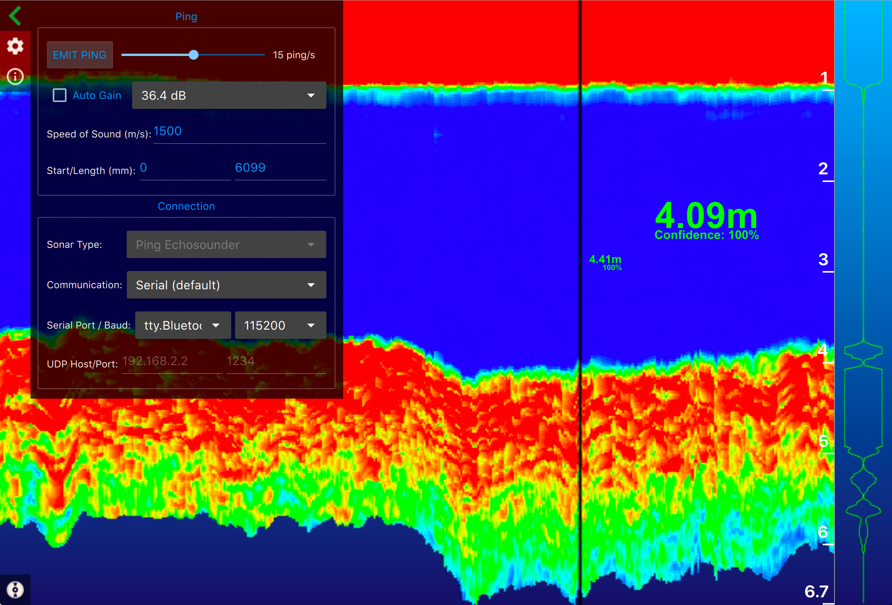
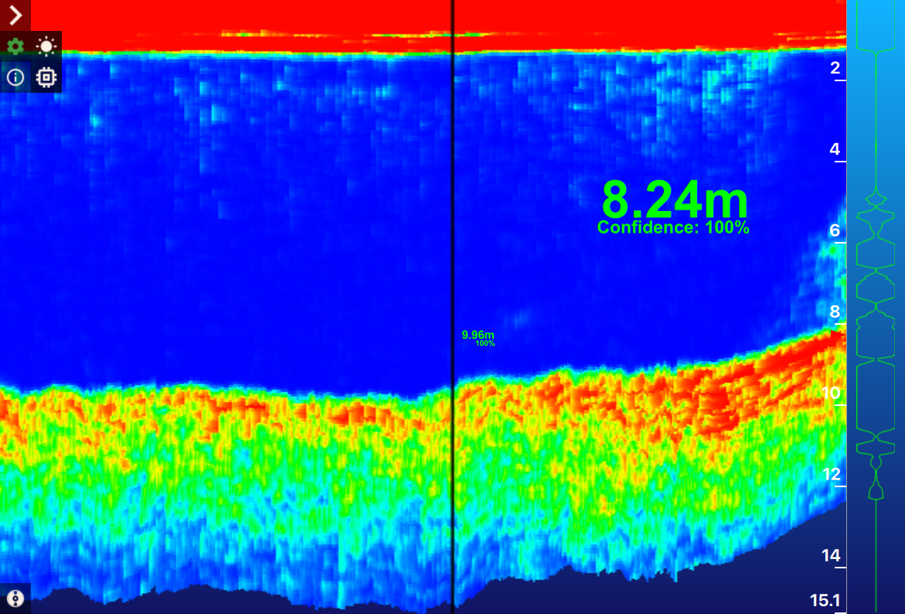
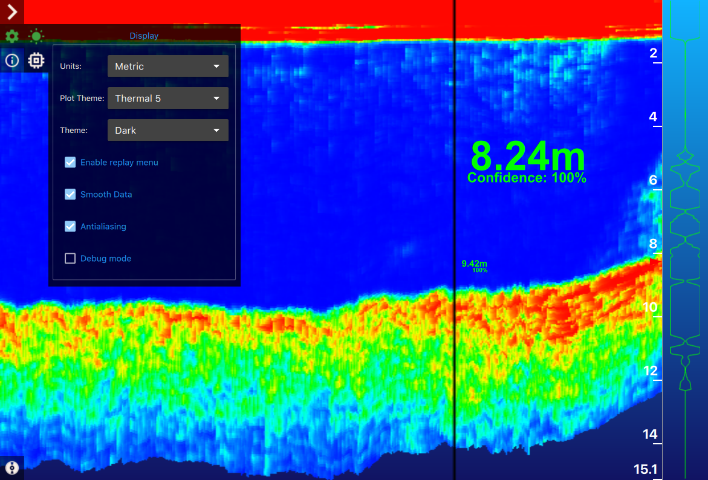
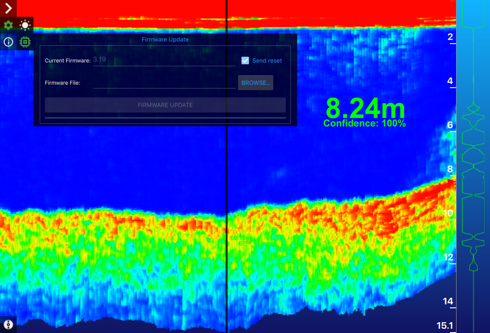
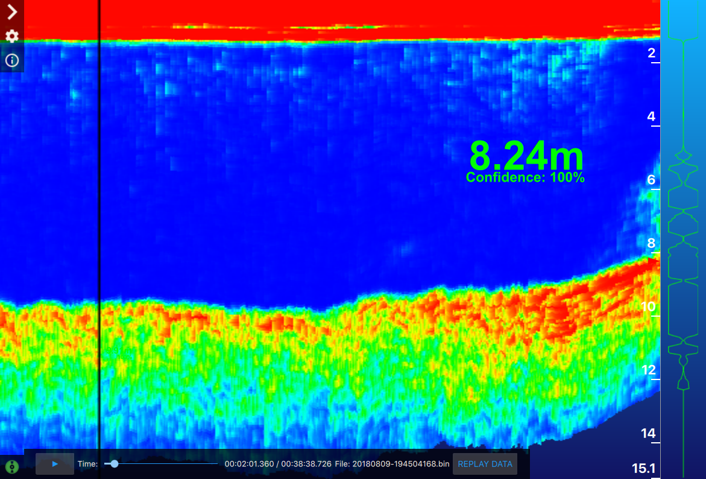

# Download links
The interface can run in multiple operating systems.
* Windows
* Mac
* Linux

Check here for last **stable releases**.

[Check here](https://github.com/bluerobotics/ping-viewer/releases/tag/continuous) for **development releases**.

## Folder structure
Ping-Viewer will create 3 folders under your user documents folder.
 * Windows: `~/My Documents`
 * Mac: `~/Documents`
 * Linux: `~/Documents`
    * **Gui_Log**: Will save all graphic interface logs for debug (*.txt).
    * **Sensor_Log**: Will save all communication made with sensors (*.bin).
    * **Pictures**: Will save all screenshots made with the hotkeys (*.png).
    * **Waterfall_Gradients**: Can be used by the user to create gradients for the waterfall (.txt).

All files follow the same rule for names: YMD-hmsl, for Year(Y), Month(M), Day(D), Hour(h), Minute(m), second(s) and milisecond(l).

## Hotkeys
There is total 3 shortcuts in the interface:
 * **R**: Reset waterfall draw.
 * **S**: Grab a screenshot of the graphic interface.
 * **W**: Grab a screenshot of the waterfall.

## Interface:
The interface has 4 important components:
 1. Chart: Located in the right corner, a vertical plot of signal power per time.
 2. Waterfall: Located in the middle of the interface, a time presentation of the last samples.
    1. It's possible to see previous depth and confidences with the vertical time line reference.
    2. In the right corner a depth axis shows the distance by intervals.
 3. Readout: Widget that shows actual depth and confidence.
 4. Main Menu: Located in the left corner of the interface.



## Main Menu:
With four submenus:
 * Control
 * Settings/Configuration
 * Information
 * Replay

### Control Menu:


It's possible to control:
 * Sensor measurement frequency
 * Auto gain.
 * Manual gain selection.
 * Speed of sound.
 * Minimal distance and length of analysis.

It's also possible to realize the connection configuration if auto connection is not able to find your device.
 * Sensor type (Right now only ping is available).
 * Connection type:
    * Serial.
    * UDP.
    * Simulation.
  * Serial port and baudrate.
  * IP address and port for the UDP connection.



### Settings/Configuration Menu:


The settings menu has 2 submenus:
 * Appearance
 * Firmware updates



#### Appearance configuration
>Note: The idea here is to define paths to submenus and configurations via symbols:

 

* Units:
    * Metric
    * Imperial
* Plot Theme:
    * Thermal 5
        * blue, yellow, green, yellow, red
    * Thermal 6
        * black, blue cyan, green, yellow, red
    * Thermal 7
        * black, blue cyan, green, yellow, red, white
    * Monochrome
        * black, white
    * Ocean
        * RGB(48,12,64),
        RGB(86,30,111),
        RGB(124,85,135),
        RGB(167,114,130),
        RGB(206,154,132)
    * Transparent
        * RGB(20, 0, 120),
        RGB(200, 30, 140),
        RGB(255, 100, 0),
        RGB(255, 255, 40),
        white
    * Fishfinder
        * RGB(0, 0, 60),
        RGB(61, 6, 124),
        RGB(212, 45, 107),
        RGB(255, 102, 0),
        RGB(255, 227, 32),
        white
    * Rainbow
        * black, magenta, blue, cyan, dark green, yellow, red, white
* Interface Theme:
    * Dark
    * White
* Enable Replay Menu:
    * Shows the bottom left corner menu to play logs
* Smooth Data
    * Uses a discrete low pass filter with α=0.2.
* Antialiasing
    * Indicates that the engine should antialias edges of primitives if possible.
* Debug Mode
    * Enable super powers (_With Great Power Comes Great Responsibility_).



#### User gradients
The user can create his own gradients for the waterfall, for this, it's necessary to create a file that follow some rules inside **Waterfall_Gradients** folder.
1. Filenames need to have .txt extension.
2. Filenames will be used as gradient name.
3. Filenames with underscores will be replaced with spaces.
4. Lines that do not start with # will not be processed.
5. Color values need to follow:
    1. #RGB (each of R, G, and B is a single hex digit)
    2. #RRGGBB
    3. #AARRGGBB
    4. #RRRGGGBBB
    5. #RRRRGGGGBBBB

    There is a very good tool to help with gradient colours [here](http://www.perbang.dk/rgbgradient/).
6. First value will represent 0.0
7. The last value will represent 1.0
8. The value of any other color will be `1.0*((color position) - 1)/(number of colors)`

This is an example of gradient file:
```
; Put this example in a file called `Gradient_test.txt` in **Waterfall_Gradients**.
#000000
#ffffff
#ff0000
```

Where `#000000` is white (low power signal - 0.0), `#ffffff` (average power signal - 0.5) is black and `#ff0000` is red (max power signal - 1.0).

#### Firmware updates
 

It's possible to set a new firmware in the device.
> Note: This will only work with sensors that are running and working properly. Check your sensor documentation to flash it again if it's bricked.

Steps to flash the device:
1. Connect with it with **Control Menu**.
2. Open **Firmware Update**
    * Check if _Current Firmware_ shows the actual firmware version running in the device.
3. Use the _Browse.._ button to select a new firmware.
4. Click in _FIRMWARE UPDATE_ to start the process.
5. Wait until the process bar is completely full and start the 'waiting state' again.




### Information Page:


This page has 3 important parts:
* Header: with interface and sensor information. Including 4 buttons in the bottom.
    * Header Top:
        * Interface:
            * Version tag
            * Repository link
            * Software commit version
            * Interface release date
        * Sensor:
            * Device ID
            * Model ID
            * Firmware Version
            * Sensor ID
        * Lock
    * Header Bottom:
        * Lock: Scroll lock and unlock for logger.
        * Chat: Open Blue Robotics forum.
        * Warning: Open issue list for reports.
        * Reset: Reset interface settings.
* Log: Shows all events emitted by the interface with the selected categories.
* Log categories: List of all available categories to be selected for debug.


### Replay Menu


Can be used to replay logs that are under `Sensor_Log`.
1. The play/pause button can be used to control the replay.
2. The time bar can be used to control the timestamp.
3. **REPLAY DATA**: Button used to select sensor log.

